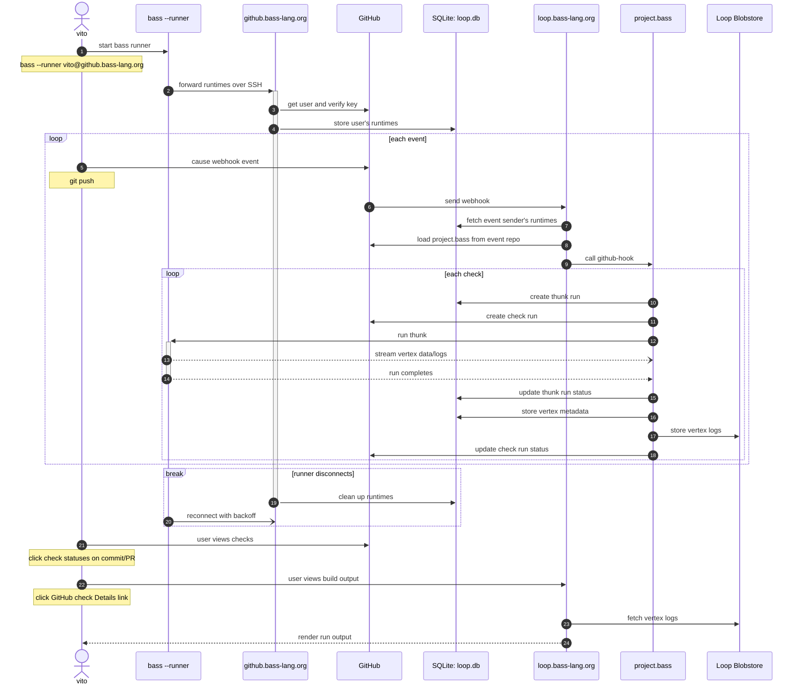

# User <-> GitHub <-> Bass Loop sequence diagram

The following diagram shows how all the components interact in a typical flow
using Bass Loop to run thunks published as status checks to GitHub.

It's pretty involved and might have too much detail; PRs welcome for clarity!

The example user 'vito' below may be a project maintainer or a contributor.

There are additional notes included in the source markdown file that explain
even more details; they're commented out so it's not too overwhelming.

